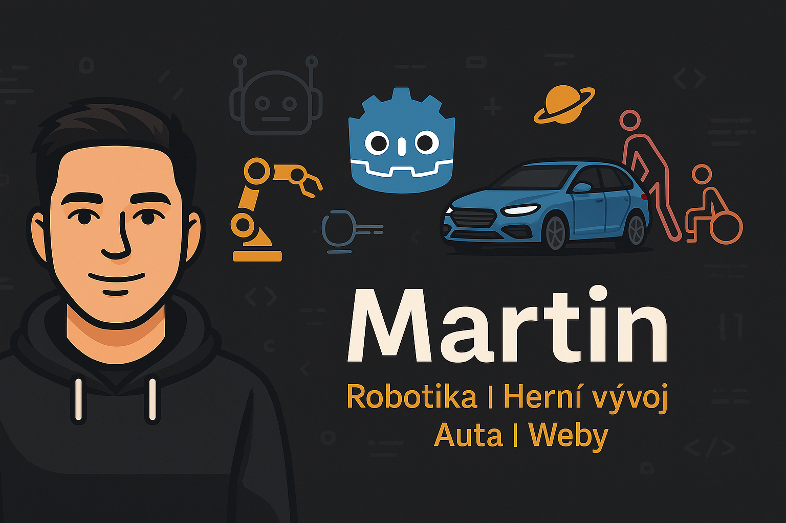

# Martin - Programátor robotů & začínající vývojář her 🎮🤖

## 👋 O mně
Jmenuji se Martin a jsem programátor robotů, specializuji se na **KUKA roboty a PLC systémy** (Simatic S7). Pracuji na projektech v průmyslu, kde propojuji roboty, automatizaci a řídící systémy.

Ve volném čase se učím **vývoj her v Godot Engine 4.4.1**, kde začínám s projekty jako **Snake** a plánuju rozšiřovat znalosti v oblasti herní logiky a programování.

Jsem nadšenec do **automobilů**, **mechaniky**, **webového vývoje** a **fitness**. Baví mě technické výzvy, rád analyzuji systémy a učím se nové technologie krok za krokem.

---

## 🔧 Technologie a nástroje
- 🤖 KUKA Robotics (KRL)
- 💾 Siemens S7 (TIA Portal)
- 🎮 Godot Engine 4.4.1 (GDScript)
- 💻 Visual Studio Code, HTML, CSS, JavaScript
- 📜 Python (pro automatizaci a analýzu)
- ⚙ Autor v oblasti webu: VS Code Live Server

---

## 🚀 Projekty a zájmy
- 🐍 **Snake Game (Godot 4.4.1)**  
  Vlastní verze Snake hry s optimalizovaným pohybem, wrapováním a správným otáčením rohů.
  
- 🛠 **Programování KUKA robota**  
  Tvorba strukturovaných programů podle firemních norem včetně maker, UP sekcí, vizualizace.

- 🌐 **Vlastní webová stránka**  
  Pracuji na osobním webovém projektu s tématy jako vesmír, biologie, programování, auta a fitness.

---

## 🚗 Auta a technika
- Audi A4 B8 2.0 TDI 105 kW (2011)
- Škoda Octavia III 2.0 TDI 110 kW (chip 130 kW) 4x4 (2013)
- Zájem o mechaniku motorů, chiptuning, srovnávání výkonu a točivého momentu

---

## 💡 Co mě teď zajímá
- Vývoj her v Godot Engine (GDScript, herní mechaniky)
- Vytvoření plně funkční webové prezentace (HTML/CSS)
- Automatizace testování PLC a robotických systémů
- Vytvoření jednoduchých webových her (Dino game, Idle clicker)

---

## 📫 Kontakt

###

  
  
  
  
  
  

###

---

> **Můj přístup:**  
> Radši pomalu, krok za krokem, ale pořádně a s přesahem. Mám rád čistotu kódu, funkční logiku a preciznost jak v programování, tak v reálném světě techniky.

---

